# Exercise 1- Secure administration and management

Azure Monitor Network Insights provides a comprehensive and visual representation through topologies of the health and metrics of all deployed network resources without requiring any configuration. 

The topology capability of Azure Network Watcher enables you to view all of the resources in a virtual network, the resources associated with the resources in a virtual network and the relationships between the resources.

Azure Bastion is a fully managed service provided by Microsoft Azure that enables secure and seamless Remote Desktop Protocol (RDP) and Secure Shell (SSH) access to virtual machines (VMs) within a virtual network (VNet) without the need for a public IP address or a virtual private network (VPN) connection.

Azure Monitor Network Insights provides a comprehensive and visual representation through topologies of the health and metrics of all deployed network resources without requiring any configuration. It also provides access to network monitoring capabilities like Connection Monitor, flow logging for network security groups (NSGs), and traffic analytics.

This exercise includes the following tasks:

  - Network Health
  - Network Topology
  - Secure Access via Bastion Host
  - Prepare the Network Watcher monitoring environment and NSG Flow
  
## **Task 1: Network Health**

In this task, you'll explore Azure monitor and examine the resource health of various deployed resources. 

1. Navigate to the Azure portal. Using the search bar, search for **Monitor (1)** and **select (2)** from the suggestions.

   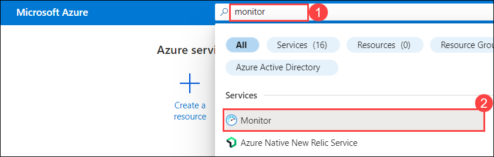

1. From the sidebar, select **Networks** from Insights.

   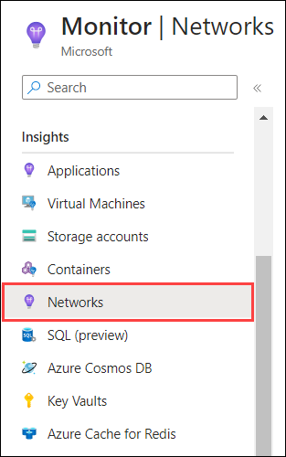
   
1. On the **Network health** tab, you can customize the resource health and alerts view by using filters like **Subscription**, **Resource Group**, and **Type**, and you can use the search box to search for resources and their associated resources. For example, a public IP is associated with an application gateway. A search for the public IP's DNS name will return both the public IP and the associated application gateway.

   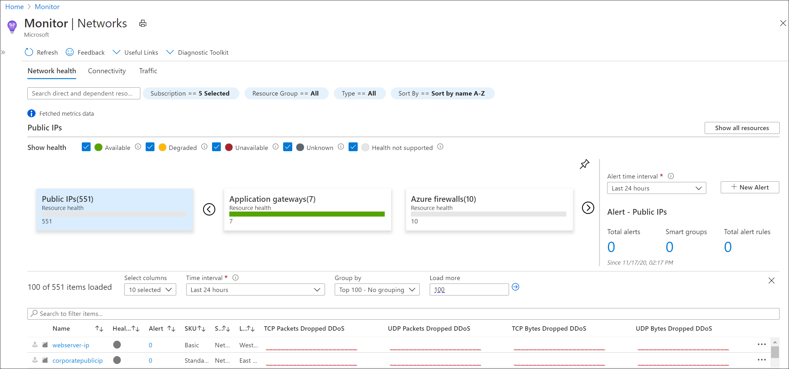

1. In this, each tile represents a resource health. The tile displays the number of instances of that resource health deployed across all selected subscriptions. 

   

1. You can click on any resource to select the resource view, The resource view helps you visualize how a resource is configured. The resource view is currently available for **Azure Application Gateway**, **Azure Virtual Network**, and **Route table**. For example, for Application Gateway, you can access the resource view by selecting the Application Gateway resource name in the metrics grid view. You can do the same thing for Azure Virtual Network, and route table.

   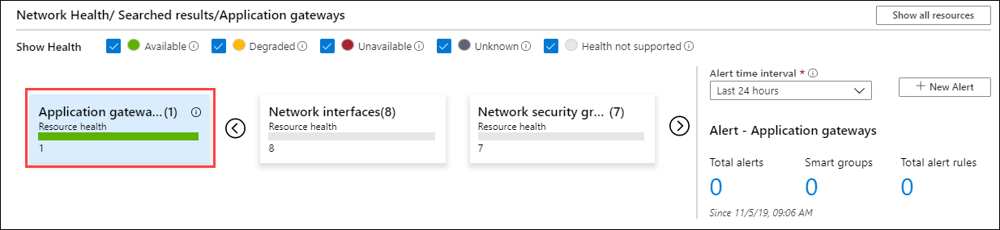

1. Click on the **Throughput** icon next to the location to bring up the Metrics.
   
    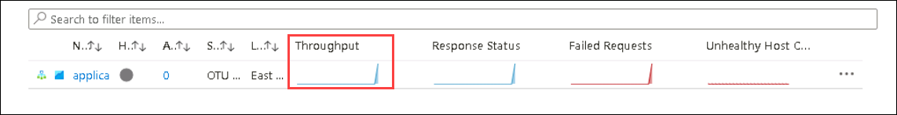
     
1. You will see the **Metrics** as given below:

    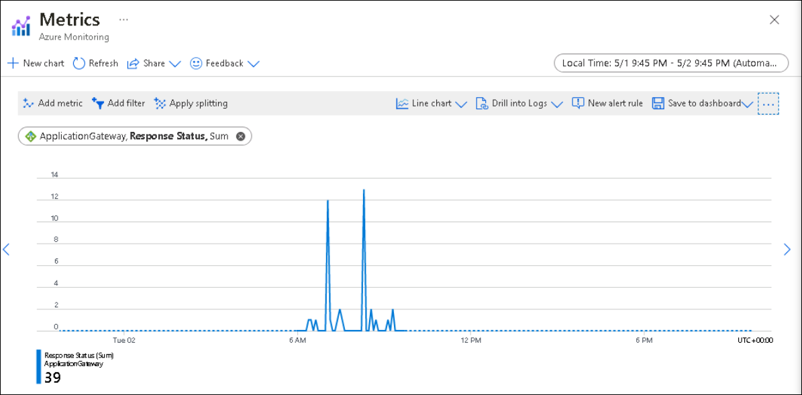

## **Task 2: Network Topology** 

 In this task, you'll view resources in a Microsoft Azure virtual network, and the relationships between the resources.

1. Navigate to the Azure portal. Using the search bar, search for **Network Watcher (1)** and **select (2)** from the suggestions.

   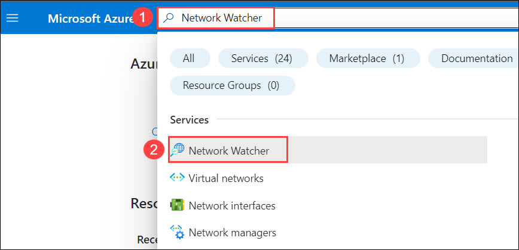

1. From the sidebar, select **Topology** from Monitoring.

   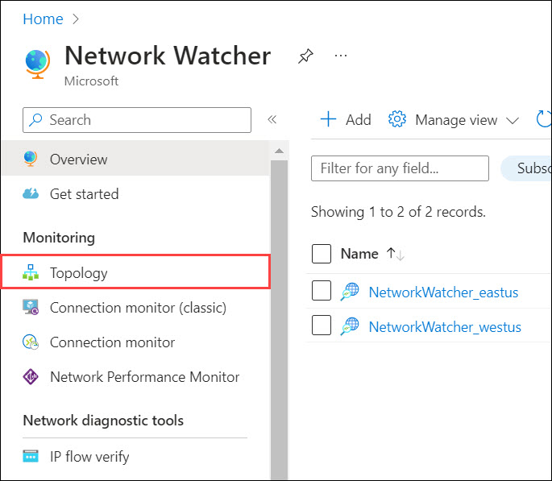
   
1. Now, you'll be able to **visualize (1)** the topology. You can explore the different connections to understand how different resources such as virtual machines, subnets, virtual network gateways, and other network components are interconnected and how they communicate with each other. You can also download the topology by clicking on **Download topology (2)**.

   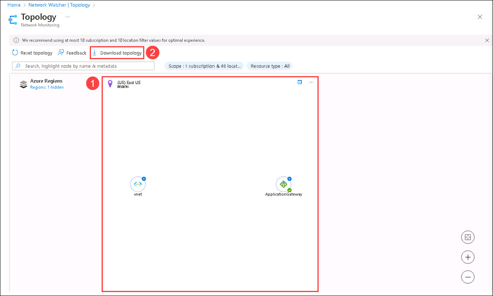

   >**Note:** You can click the **Plus icon** next to the location to view the resource in the visual format.

## **Task 3: Secure Access via Bastion Host**

In this task, you'll learn how to access an Azure virtual machine using the Azure Bastion service.

1. Navigate to the Azure portal. Using the search bar, search for **Virtual networks (1)** and **select (2)** from the suggestions.

   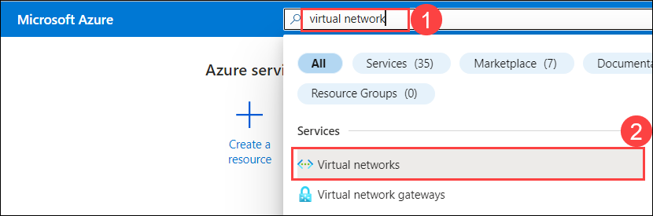

1. Select the **vnet** from the list.

   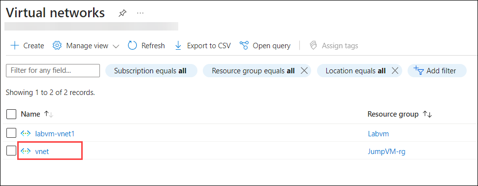

1. From the sidebar, select **Subnets** from Settings.
   
   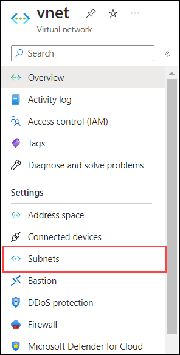

1. You will see that **AzureBastionSubnet** is already present in the subnets, If you want to see the subnet configuration, then you can click on the AzureBastionSubnet subnet and explore this.

   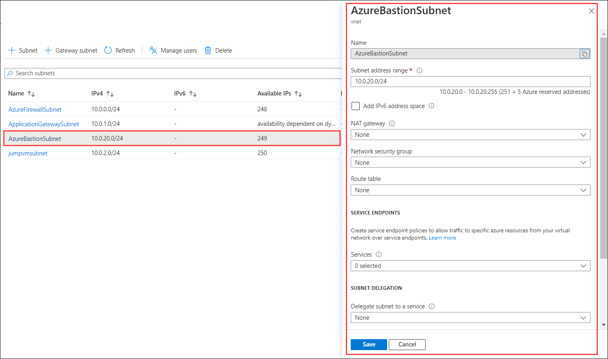

1. Now Using the search bar, search for **Virtual machines (1)** and **select (2)** from the suggestions.

   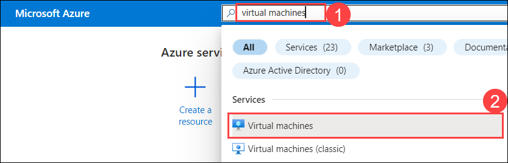

1. Select the **JumpVM-<inject key="DeploymentID" enableCopy="false" />** from the list.

   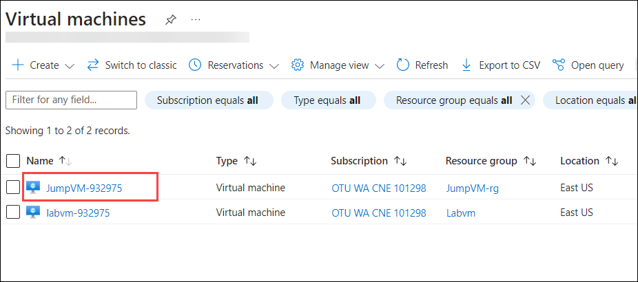

1. On the Virtual Machine page, under **Connect**, click on **Connect (1)** then click on **Go to Bastion (2)**.
 
   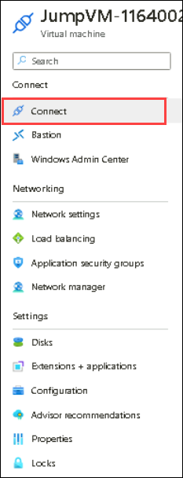
 
1. On the Bastion page, follow the below-mentioned instructions to connect to the Virtual Machine using Bastion:

     
 
    - **Authentication Type**: Ensure **VM Password (1)** is chosen from the drop-down
    - **Username**: Enter **<inject key="JumpVM Admin Username" enableCopy="false" /> (1)**
    - **Password**: Enter **<inject key="JumpVM Admin Password" enableCopy="false" />(3)**
    - Click on **Connect (4)**
 
      

       >**Note:** If the popup blocker prevents the new window, select the allow popup blocker and click on Done and Connect again.
  
        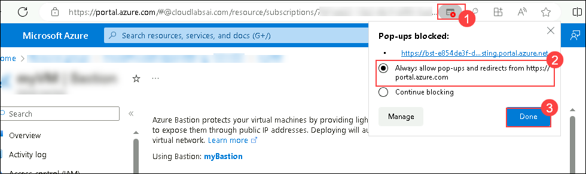
  
   
1. Now, you will be redirected to a new tab where the Bastion VM is opened. If you see the pop-up **See text and images copied to the clipboard**, click on **Allow**.
 
    

   
## **Task 4: Prepare the Network Watcher monitoring environment and NSG Flow**

NSG Diagnostic Logs provide detailed information about the health and performance of a Network Security Group. These logs include data related to the configuration changes, rules evaluation, and the overall state of the NSG. Diagnostic Logs can help identify issues with NSG rules, detect unauthorized access attempts, and monitor the NSG's behavior.

NSG Flow Logs capture information about the network traffic flowing through a Network Security Group. They provide visibility into the network communications and can be used for analyzing network behavior, detecting threats, and investigating security incidents.

In this task, You will create NSG flow logs that will provide detailed information about the network traffic that passes through your NSG. This information can be used for troubleshooting network connectivity issues, monitoring and analyzing network traffic patterns, and detecting potential security threats.

1. Navigate to the Azure portal. Using the search bar, search for **Resource group (1)** and **select (2)** from the suggestions.

   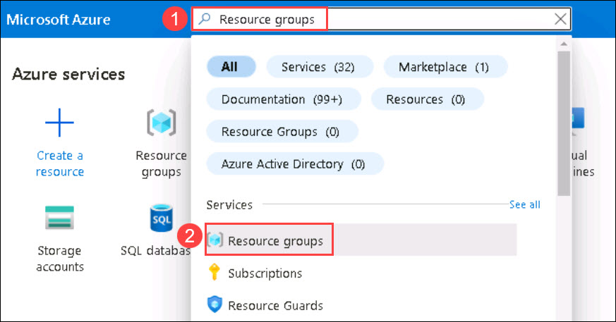

1. Select the **JumpVM-rg** from the list.

   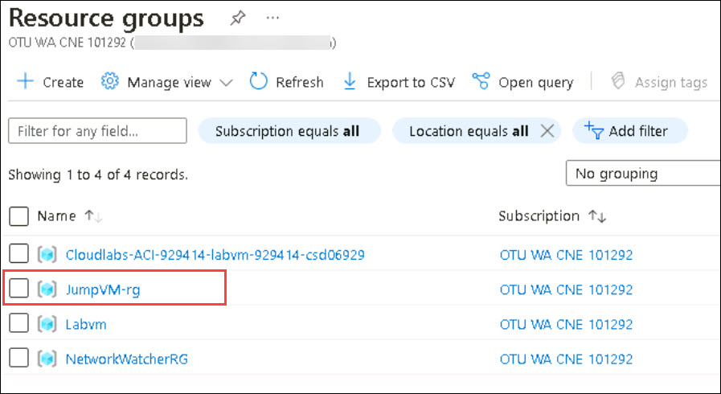

1. From the list of resources, select the Network Security Group named **JumpVM-<inject key="DeploymentID" enableCopy="false" />-nsg**.

   

1. In the sidebar, select **NSG flow logs** from the Monitoring menu.

   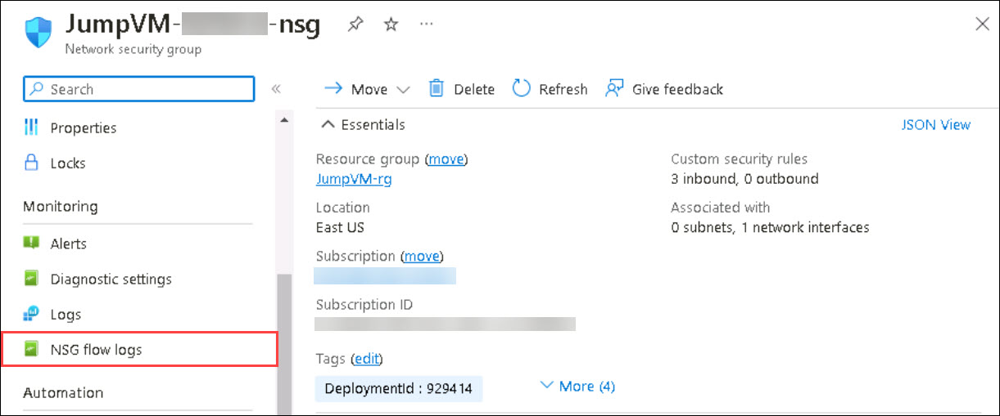

1. Click on the **create** button.

   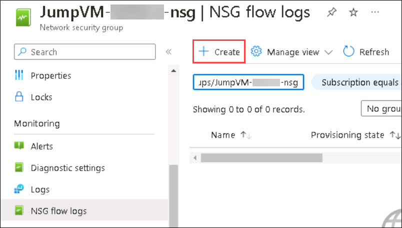

1. In the Create a flow log page, select the **default subscription (1)** in the drop-down and click on **Select resource (2)**.

   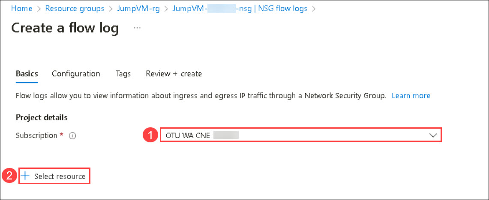

1. In the Select network security group page, select **JumpVM-<inject key="DeploymentID" enableCopy="false" />-nsg** **(1)** and click on **Confirm selection (2)**.

   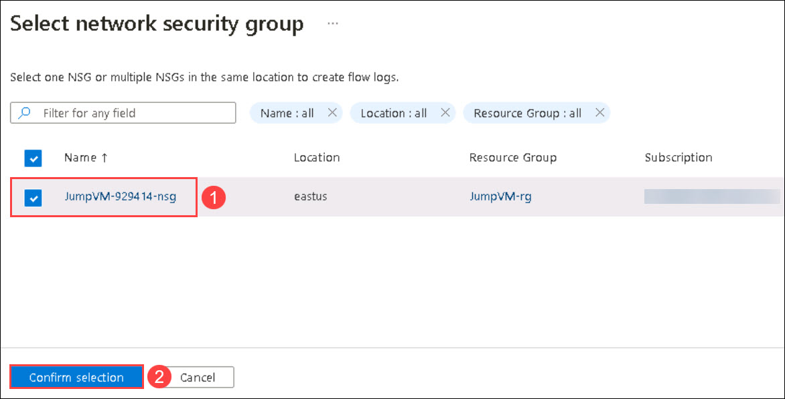

1. For the Instance details, Provide the following details and click on **Next: Analytics > (4)**

   - **Subscription**: select **default subscription (1)** from the drop-down.
   - **Storage account**: select **nsglogs<inject key="DeploymentID" enableCopy="false" />** from the drop down.
   - **Retention (days)**: **30 (3)**

      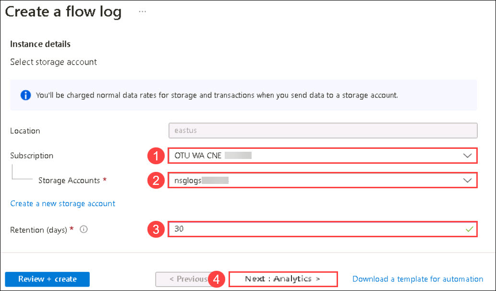  
   
1. Under the **Analytics** tab, check the box to **Enable Traffic Analytics (1)**, select **Every 10 mins (2)** under the Traffic Analytics processing interval and click **Review + Create (3)**.

   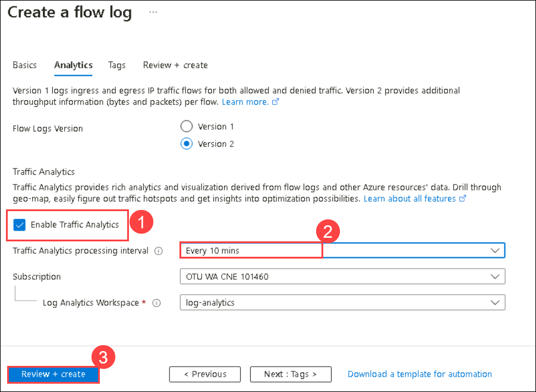

1. In the Create page, click on the **Create** button, and wait till the deployment completion.

   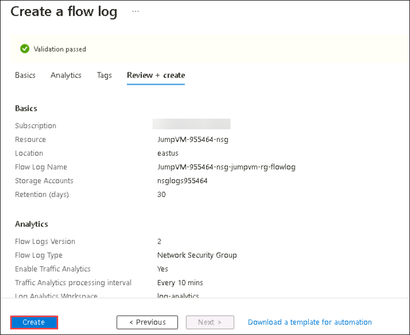  

1. Navigate to the Azure portal. Using the search bar, search for **Resource group (1)** and **select (2)** from the suggestions.

   

1. Select the **JumpVM-rg** from the list.

   

1. From the list of resources, select the Network Security Group named **JumpVM-<inject key="DeploymentID" enableCopy="false" />-nsg**.

   

1. From the sidebar, select **Diagnostic settings (1)** and click on **+ Add diagnostic setting (2)**.

   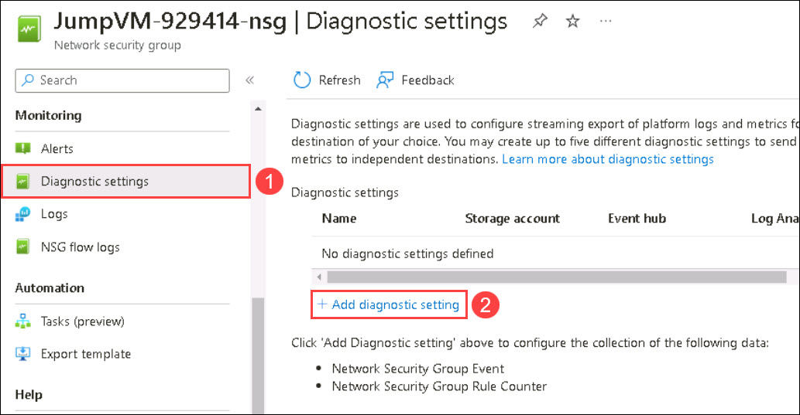

1. In the Diagnostic settings page, provide the following details and click on **Save (5)**.

   - **Diagnostic setting name**: **NSG_Flow_Logs (1)**
   - **Logs> Category groups**: check the **allLogs (2)** checkbox.
   - **Destination details**: Select **Send to Log Analytics workspace (3)**. The existing log analytics workspace should be selected. Also select the **Archive to a storage account (4)** checkbox,and Click on **Save(5)**. Make sure the default subscription is selected for subscription and nsglogs<inject key="DeploymentID" enableCopy="false" /> for storage account.

      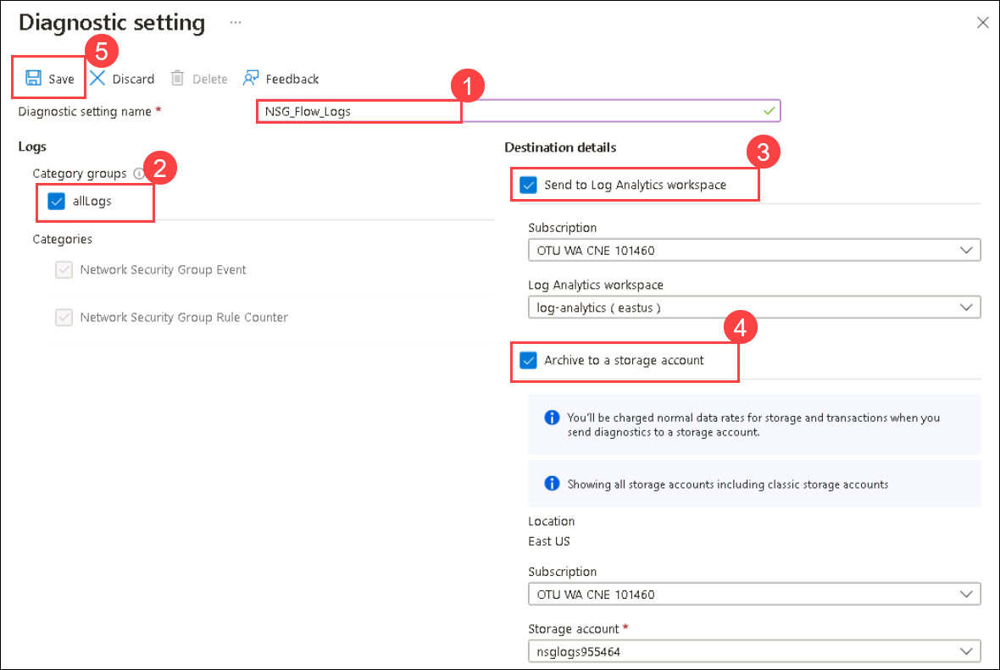
   
      > **Congratulations** on completing the lab! Now, it's time to validate it. Here are the steps:
      > - Navigate to the Lab Validation Page, from the upper right corner in the lab guide section.
      > - Hit the Validate button for the corresponding task. If you receive a success message, you can proceed to the next task. 
      > - If not, carefully read the error message and retry the step, following the instructions in the lab guide.
      > - If you need any assistance, please contact us at labs-support@spektrasystems.com. We are available 24/7 to help you out.

## Summary
 
In this exercise you have covered the following:
  
   - Explored on Network health 
   - Explored on Network topology
   - Secured Access via Bastion Host
   - Configured the Network Watcher monitoring environment and NSG Flow
