# Exercise 5- Network Management and Monitoring Revisited: Flow Logs and Traffic Analytics

Network management and monitoring play a crucial role in maintaining a secure and efficient network infrastructure. In addition to traditional monitoring methods, flow logs and traffic analytics provide valuable insights into network traffic patterns and behavior.

Flow logs capture detailed information about network flows, including source and destination IP addresses, ports, protocols, and packet counts. They offer visibility into network traffic at the packet level, aiding in troubleshooting, detecting anomalies, and understanding network behavior.

Combining flow logs and traffic analytics enables network administrators to gain comprehensive visibility, streamline troubleshooting, and make data-driven decisions for network optimization and security enhancement.

This exercise includes the following tasks:

  - NSG Validation
  - Network Watcher Traffic Analytics to monitor the network
  
## **Task 1: NSG Validation (Optional)**

In this task, you'll access the virtual machine by configuring an inbound port rule in the network security group.

1. Navigate to the Azure portal. Using the search bar, search for **Virtual machines (1)** and **select (2)** from the suggestions.

   
   
1. Select the **labvm-<inject key="DeploymentID" enableCopy="false" />** from the list.

   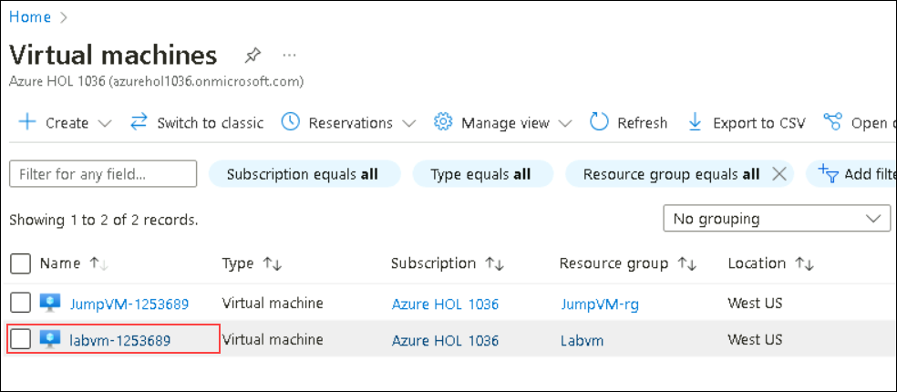
 
1. From the sidebar, select **Network settings** under **Networking** option.

   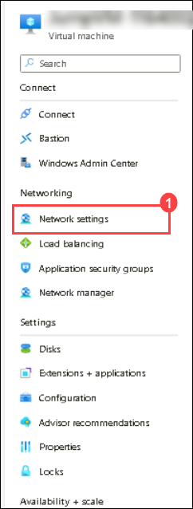

1. On the Network settings page, Click on **default-allow-rdp (1)** inbound port rule to edit the configuration, select **Deny (2)** from Action and click on **Save (3)**.

   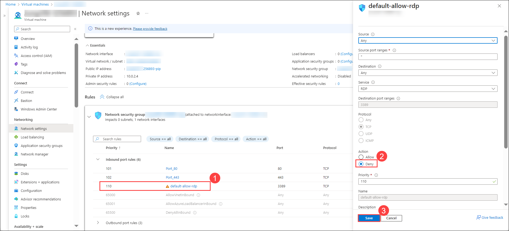
   
1. On the JumpBox VM, in the search bar, **Search** for **RDP** and **select** the **Remote Desktop Connection** app.
   
   

1. Paste the **Labvm DNS Name** in the **Computer** field and click on **Connect**.
   * **Labvm DNS Name**: **<inject key="Labvm DNS Name" />**

        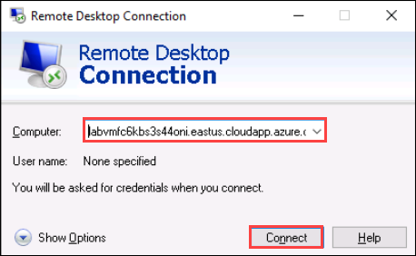  
 
1. You will see the error **Remote desktop can't be connected to the remote computer** because we are denied the inbound rule for disallowing the RDP and clicking on **OK**.

   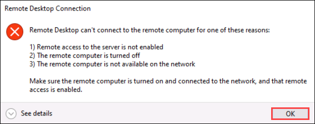
   
1. Navigate back to the **labvm-<inject key="DeploymentID" enableCopy="false" />**, Open Networking tab and click on **default-allow-rdp (1)** inbound port rule to edit the configuration, select **Allow (2)** from Action and click on **Save (3)**.

   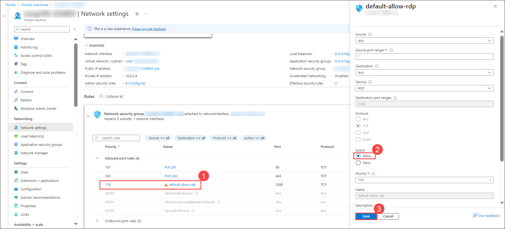

1. Navigate back on **Remote Desktop Connection**, click on **Connect** and you will see that you are able to connect to the VM.

1. Now, enter the LabVM **username**, and **password** provided below and then click on the **OK** button.
    - **Username**: **<inject key="Labvm Admin Username" />**
    - **Password**: **<inject key="Labvm Admin Password" />**
   
        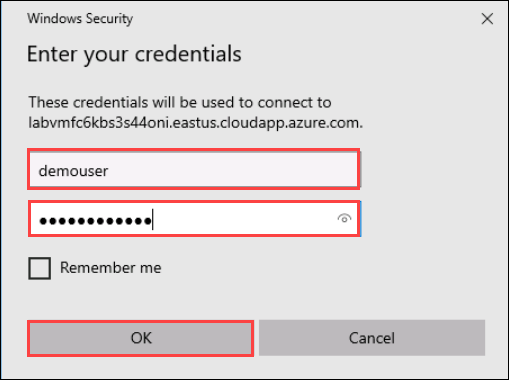
   
1. Next, click on the **Yes** button to accept the certificate and add in trusted certificates.

   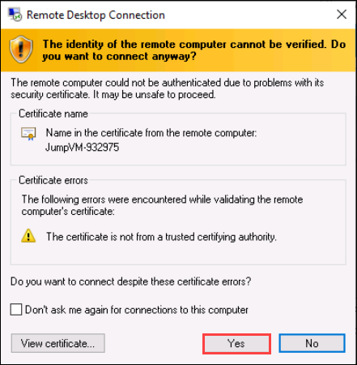

 ## **Task 2: Configure WAF to protect your web application**
 
 In this task, you will add a Virtual Machine as the Backend pool of the Application gateway and also configure the Application Gateway from the firewall policy.
 
 1. From the Azure **Home** page, search for **Application gateways (1)** from the search bar and select **Application gateways (2)**.
 
      
    
 1. Select your **Application Gateway**.

      
      
 1. On the Application gateway blade click on the **Backend pools(1)** under setting and then select **AGBackendtarget(2)**.

     
     
 1. On the **Edit backend pool** page, follow the below-mentioned instructions:

    - **Target type**: Select **Virtual Machine (1)** from the drop-down.
    - **Target**: Select **JumpVM-<inject key="Deployment ID" enableCopy="false"/>-nic (2)** from drop-down.
    - Click on **Save (3)**.

      
    
1. Once the Backend pools are saved, you will see the notification that says **Deployment Succeeded**.

 1. Navigate back to the home page and search for **Application Firewall Policies (1)** from the search bar and select **Web Application Firewall Policies (2)**.

      
 
 1. Click on **firewallpolicy** under the Web Application Firewall page and click on **Associated application gateways** under the **Settings** tab from the Application Gateway WAF policy page.

     
     
 1. On the **Associated Application gateway** page, click on **+ Add association (1)** and select **Application Gateway(2)**

    
    
 1. Under the **Associate an application gateway** page, follow the below instructions:

    - **Application Gateway (WAF v2 SKU)**: Select **Application Gateway (1)** from the drop down. 
    - **Check** the box next to **Apply the web Application Firewall policy configuration even if it's different from the current configuration (2)**.
    - Click on **Add (3)**.

      

## **Task 3: Add firewall diagnostics settings** 

In this task, you will enable diagnostic settings in Azure Firewall to collect firewall logs.

1. Navigate to the home page in the Azure portal, search for **Subscriptions (1)** and **select (2)** from suggestions.

   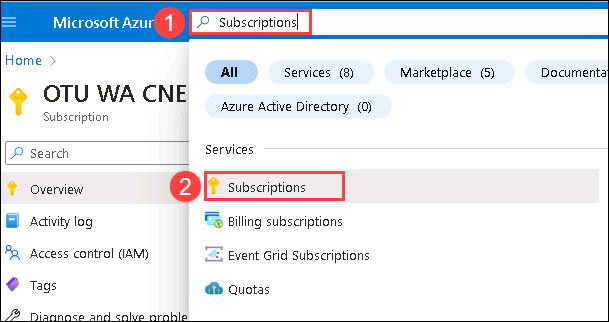

1. Select the **default subscription** available in the list.

   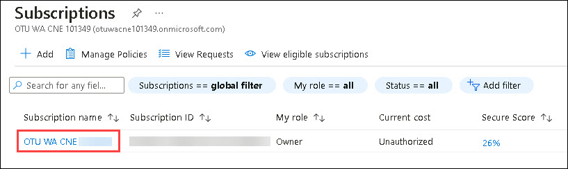

1. From the left-side blade, select **Preview features (1)** and select **Microsoft.Network (2)** in the types list.

   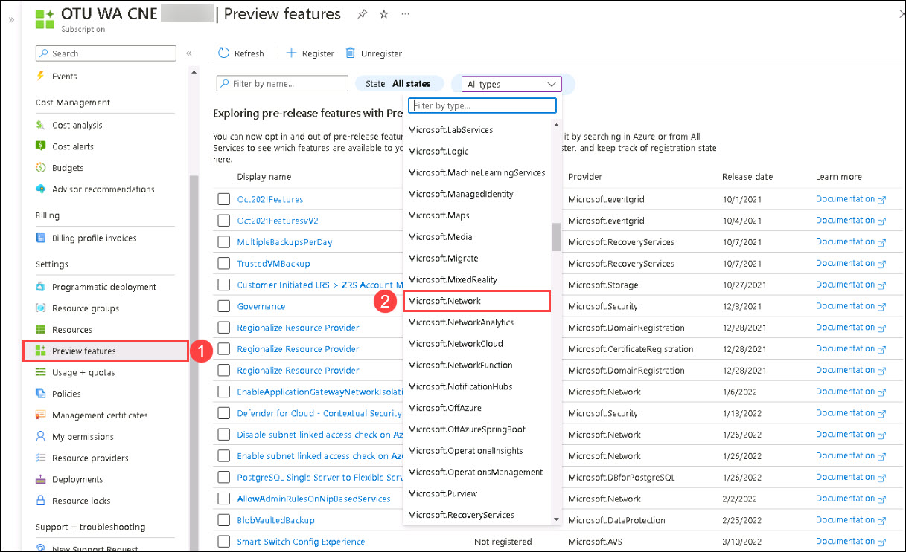

1. select **Enable Azure Firewall Structured Logs (1)** and click on **Register (2)**.

   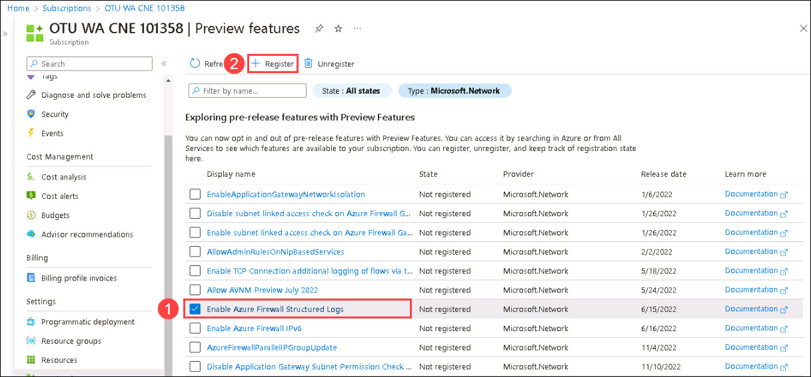

1. In the Azure portal, navigate to your **JumpVM-rg** resource group and select the AzureFirewall resource.

   

2. On the firewall page, under **Monitoring**, select **Diagnostic settings**.

   

3. Select **Add diagnostic setting** on the **Diagnostic settings**. 

   

4. Enter the **Diagnostic setting name** as **fw-diagnostics**.

   

5. Under **Logs**, select the below mentioned categories.
   
   - Azure Firewall Application Rule
   - Azure Firewall Network Rule
   - Azure Firewall Nat Rule
   - Azure Firewall Threat Intelligence
   - Azure Firewall IDPS Signature
   - Azure Firewall DNS query
   - Azure Firewall FQDN Resolution Failure
   - Azure Firewall Fat Flow Log
   - Azure Firewall Flow Trace Log

     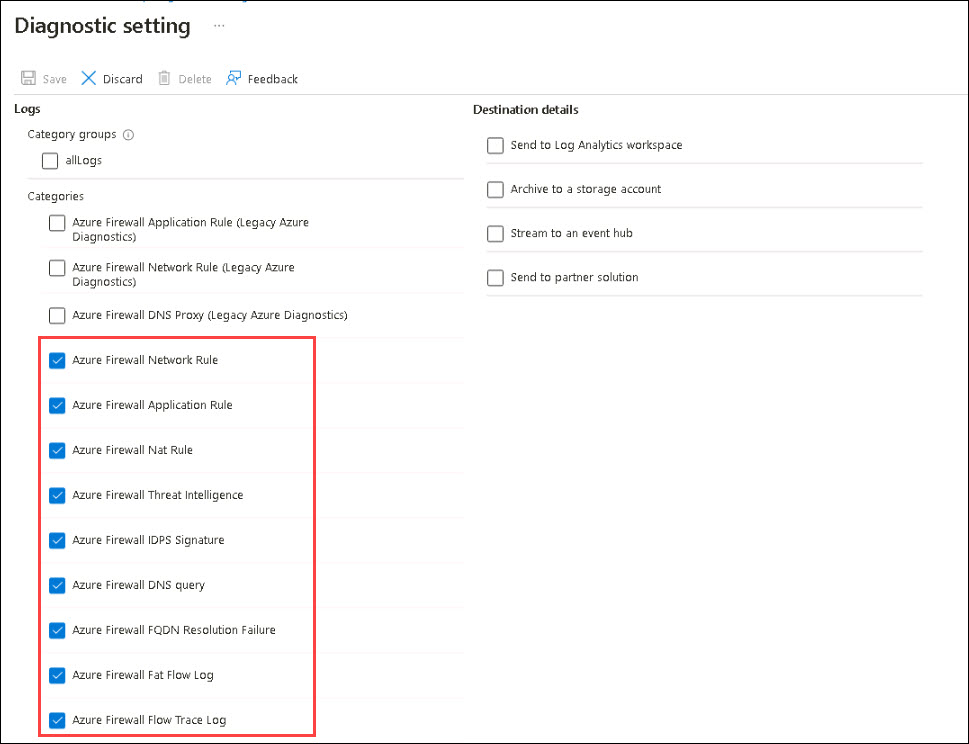

6. Under **Destination details**, select **Send to Log Analytics workspace (1)**, select **Resource specific (2)** for Destination table option, and then click on **Save (3)**.

   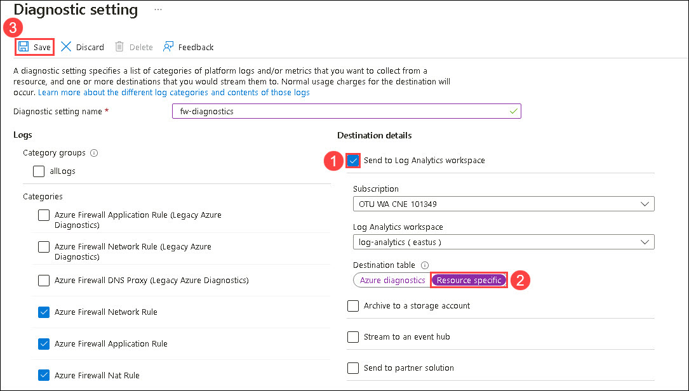

## **Task 3: Network Watcher Traffic Analytics to monitor the network**

In this task, you will enable the Traffic Analytics in the NSG flow logs and review the logs.
 
1. Navigate to the Azure portal. Using the search bar, search for **Application gateways (1)** and **select (2)** from the suggestions..
 
     
 
 1. Select your **Application Gateway**.
 
     
 
 1. Select the **Frontend public IP address** of the application gateway.
 
     
  
 1. Copy the **Public IP address** and save it to Notepad for later use.

     

 1. To test the application copy and paste the Frontend public IP address of **Application Gateway** in a new browser tab and generate some traffic by refreshing the browser.
 
      > **Note**: You will see that your website is running.
 
      

1. Navigate to the resource group **JumpVM-rg**, and from the **Overview (1)** tab select the Firewall.

   
   
1. Select **Firewall Public IP** from the Overview tab.

    
    
1. Copy the Public Ip and save it in a text editor.

    

1. Navigate back on Azure Firewall, Select **Firewall Manager (1)** from the **Settings** tab, and click on **Visit Azure Firewall Manager to configure and manage this firewall (2)**

   
    
1. Select **Azure Firewall Policies (1)** under the **Firewall Manager** page and click on Firewall Policy **firewallpolicy (2)**.

   
   
1. Select **DNAT Rules (1)** from the **Settings** tab under the **Firewall Policy** page and select **+ Add a rule collection (2)**

   
    
1. Under the **Add a rule collection** page, enter the below details:

    - Name: **afw-contoso-prod-firewall-rulecolection (1)**
    - Rule Collection type: **DNAT (2)**
    - Priority: **100 (3)**
    - Rule collection group: **DefaultDnatRuleCollectionGroup (4)**
    - Under **Rules (5)** mention the below details:
      - Name: **afw-dnat-http**
      - Source type: Select **IP Address** from the drop-down list
      - Source: Enter *
      - Protocol: Select **TCP** from the drop-down list
      - Destination Ports: **80**
      - Destination (Firewall PIP address): Enter the IP address of the **Firewall** which you copied in previous step.
      - Translated type: Select **IP Address** from the drop-down list
      - Translated address or FQDN: Enter the Public IP address of the **Application gateway** which you copied in previous step.
      - Translated port: **80**
     
     - Click on **Add (6)**.

       
      
1. Navigate to the Firewall's public IP address and generate some traffic by refreshing the browser.

   

1. Go to the Home page and search for **Network Watcher** and select it.

1. From the left hand pane of the **Network Watcher** select **Flow Logs** under **Logs**

1. Click on **Create** in the top navigation pane.

1. In the **Basics** tab, click on **Select Resource** and choose **Network Security Group** from the dropdown.

   

1. Leave eveything as default and click **Next: Analytics**.

1. In the **Analytics** tab, check **Enable Traffic Analysis** and change the **Traffic Analytics Processing Time** to **Every 15 mins**

   

1. Click **Next** and click on **Review + Create** and subsequently click on **Create**

1. Navigate back to the Network Watcher and select **Traffic Analytics**, under **Logs** from the options on the left side of the Network Watcher blade.

   
        
1. On the **Traffic Analytics** page, set the time interval to the **Last 30 minutes**.

   

1. Now, you can observe the total number of network traffic flows from **Traffic Visualization**.

    

    > **Note: The dashboard may take up to 30 minutes to appear when deployed for the first time. This is because Traffic Analytics must first aggregate enough data for it to derive meaningful insights. If it takes more time, you can perform the next task and come back later and check on this**.
           
     
1. Under **Traffic Analytics** Scroll down to **Your Environment** to view the total number of **Deployed Azure regions (1)**, **TA Enabled NSGs (2)**, **Virtual networks (3)**, and **Virtual subnetworks (4)**.

    
      
1. To visualize the traffic distribution by geography, click on **View map**. The geo-map shows the traffic distribution to a data center from countries/regions and continents communicating with it.

    
     
1. In the **Traffic Analytics Geo Map View** page, click on the **Green** icon which indicates the Azure region, and observe the resources deployed under the region, to explore more select **More details**.

    
      
1. Under the **More Insights** blade, scroll down and explore traffic distribution for deployments of the East US region.

    
     
1. To close the **Traffic Analytics Geo Map View**, click on the cross at the top right corner.

     
      
1. Close the **Ports receiving traffic from the Internet** page by clicking the **Cross (X) icon** from the top right corner.
      
1. Under the Traffic Analytics page, scroll down to **Traffic Distribution** to view the analytics of traffic flows across the host, subnet, VNet, and VMSS.

    
     
1. To view the analytics of traffic flows across the host, select **IP (1)**, then select **See all (2)** from **Traffic Distribution**.

    
    
1. You can observe the graph of the **Time trending chart for the top 5 talking IPs** from the **Traffic distribution across the top IPs** page.

    
    
1. Under **Details of top 5 talking IPs**, select VM IP to explore more about traffic distribution.

     
     
1. Close the **Traffic distribution across top IPs** by clicking the **cross (X) icon** at the top-left corner of the page.
    
1. In the same way, you can explore more about **Malicious traffic**, and **Blocked traffic** 

1. Now scroll down to **Application ports**, to view analytics for application ports utilized across your environment and select **See all**.

    
     
1. From the **Most frequent L7 protocols** page, you can explore more about the ports and their ranging.

    

## **Summary**
 
In this exercise you have covered the following:
  
   - Performed NSG validation.
   - Monitored the network watcher traffic.

 

